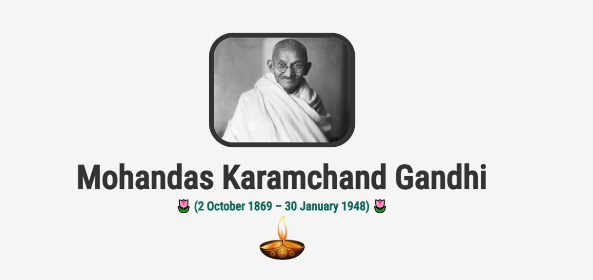

## Tribute Page

This repository contains the code and assets for the second task of Level 2 in the Oasis Infobyte internship. The task involves optimizing an HTML and CSS codebase for a Mahatma Gandhi tribute page. The improvements include better structuring, responsiveness, and overall code optimization.

## Live Demo
('''https://gandhiji-tributepage.netlify.app/''')